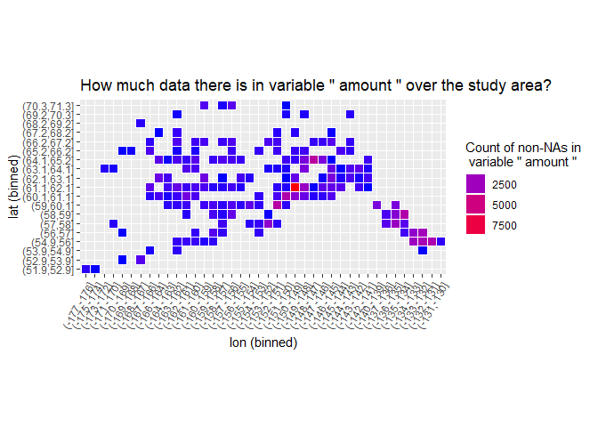

Module goal
-----------

Given a list output from metajam, (1) detect which data columns contain
spatial information, and (2) output a series of variable-specific
spatial heatmaps to indicate presence/absence of data.

Working assumptions:
--------------------

-   Only lat/lon spatial data: no distance along transects or such
-   Numeric decimal degrees
-   Only 1 lat column, only 1 lon column (or no columns detected for
    both x and y, in which case we just don't make plots at all).
    Differing numbers of columns would be difficult to deal with, as
    multiple columns per dimension ("lat\_deg" followed by "lat\_min",
    "lat\_sec")
-   Things do not span the international date line or the line where 180
    east crossed into -180 west. Unlikely since it is mostly no man's
    land.

First we look at the data, which is the Alaska fishing permit data.

    ## # A tibble: 6 x 19
    ##   area  districtName fisheryName fishCode  year gearTypeID permitTypeName
    ##   <chr> <chr>        <chr>       <chr>    <int>      <int> <chr>         
    ## 1 West~ AK Pen/Aleu~ Adak Distr~ AD        1988          0 Personal Use  
    ## 2 West~ AK Pen/Aleu~ Adak Distr~ AD        1989          0 Personal Use  
    ## 3 West~ AK Pen/Aleu~ Adak Distr~ AD        1990          0 Personal Use  
    ## 4 West~ AK Pen/Aleu~ Adak Distr~ AD        1991          0 Personal Use  
    ## 5 West~ AK Pen/Aleu~ Adak Distr~ AD        1992          0 Personal Use  
    ## 6 West~ AK Pen/Aleu~ Adak Distr~ AD        1993          0 Personal Use  
    ## # ... with 12 more variables: commname <chr>, returned <int>,
    ## #   issued <int>, species <chr>, amount <dbl>, mean <dbl>, pounds <dbl>,
    ## #   USGS_name <chr>, lat <dbl>, lng <dbl>, region_id <int>, region <chr>

    ##  [1] "area"           "districtName"   "fisheryName"    "fishCode"      
    ##  [5] "year"           "gearTypeID"     "permitTypeName" "commname"      
    ##  [9] "returned"       "issued"         "species"        "amount"        
    ## [13] "mean"           "pounds"         "USGS_name"      "lat"           
    ## [17] "lng"            "region_id"      "region"

classify\_xy
------------

This function takes a `metajam` list output for a single data table and
`"x"` or `"y"` to indicate which dimension to classify. It outputs a
logical vector equal in length to the number of columns indicated in
metadata. The output indicates if corresponding column contains spatial
(x/y) information or not.

Let's apply it to find the lat and lon columns or columns 16 and 17
respectively in our dataset:

    classify_xy(data, "x")

    ##  [1] FALSE FALSE FALSE FALSE FALSE FALSE FALSE FALSE FALSE FALSE FALSE
    ## [12] FALSE FALSE FALSE FALSE FALSE  TRUE FALSE FALSE

    classify_xy(data, "y")

    ##  [1] FALSE FALSE FALSE FALSE FALSE FALSE FALSE FALSE FALSE FALSE FALSE
    ## [12] FALSE FALSE FALSE FALSE  TRUE FALSE FALSE FALSE

Looks good! It's a simple case where "lat" and "lon" are spelled
outright and units are correctly specified as "degree". We shouldn't
expect that much.

It'd be good to improve the classifying logic here. **FEEDBACK
WELCOMED**

THE SPACE DETECTIVE
-------------------

A wrapper to `classify_xy`. It counts the number of hits we get on each
dimension and sends us to different scenarios. The ideal one is if we
get one single clean hit for each dimension. In the ideal case,
`space_detetive` returns a character vector containing the names of
columns containing lat and lon respectively.

Let's use the space detective on our data.

    space_detective(data)

    ## Space detective found a single pair of columns containing spatial information. 
    ##  Latitude column:  lat 
    ##  Longitude column:  lng

    ## $lat_col
    ## [1] "lat"
    ## 
    ## $lon_col
    ## [1] "lng"

The SPACE PLOT
--------------

A wrapper to wrap them all. It takes metajam output and a variable to
generate a heatmap indicating how many non-NA values of that variable
are present over the study area. x and y axes are binned to account for
large study areas and also long and narrow study areas.

Apply this to our data. Let's choose to see how much data there is in
the variable "amount", since a casual scan of the data reveals that this
seems to be a variable users would be interested in. (Cool if we have AI
to detect these variables of interest as well.)

    space_plot(data, "amount")

    ## Space detective found a single pair of columns containing spatial information. 
    ##  Latitude column:  lat 
    ##  Longitude column:  lng

Now we can loop this over all variables.
