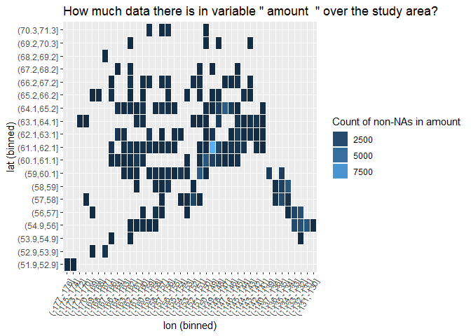

Module goal
-----------

Given a list output from metajam, (1) detect which data columns contain
spatial information, and (2) output a series of variable-specific
spatial heatmaps to indicate presence/absence of data.

Working assumptions:
--------------------

-   Only lat/lon spatial data: no distance along transects or such
-   Numeric decimal degrees
-   Only 1 lat column, only 1 lon column (or no columns detected for
    both x and y, in which case we just don't make plots at all).
    Differing numbers of columns would be difficult to deal with, as
    multiple columns per dimension ("lat\_deg" followed by "lat\_min",
    "lat\_sec")
-   Things do not span the international date line or the line where 180
    east crossed into -180 west. Unlikely since it is mostly no man's
    land.

Anything else we have yet to deal with
--------------------------------------

    ## $data
    ## # A tibble: 109,805 x 19
    ##    area  districtName fisheryName fishCode  year gearTypeID permitTypeName
    ##    <chr> <chr>        <chr>       <chr>    <int>      <int> <chr>         
    ##  1 West~ AK Pen/Aleu~ Adak Distr~ AD        1988          0 Personal Use  
    ##  2 West~ AK Pen/Aleu~ Adak Distr~ AD        1989          0 Personal Use  
    ##  3 West~ AK Pen/Aleu~ Adak Distr~ AD        1990          0 Personal Use  
    ##  4 West~ AK Pen/Aleu~ Adak Distr~ AD        1991          0 Personal Use  
    ##  5 West~ AK Pen/Aleu~ Adak Distr~ AD        1992          0 Personal Use  
    ##  6 West~ AK Pen/Aleu~ Adak Distr~ AD        1993          0 Personal Use  
    ##  7 West~ AK Pen/Aleu~ Adak Distr~ AD        1995          0 Personal Use  
    ##  8 West~ AK Pen/Aleu~ Adak Distr~ AD        1996          0 Personal Use  
    ##  9 West~ AK Pen/Aleu~ Adak Distr~ AD        1997          0 Personal Use  
    ## 10 West~ AK Pen/Aleu~ Adak Distr~ AD        1998          0 Subsistence   
    ## # ... with 109,795 more rows, and 12 more variables: commname <chr>,
    ## #   returned <int>, issued <int>, species <chr>, amount <dbl>, mean <dbl>,
    ## #   pounds <dbl>, USGS_name <chr>, lat <dbl>, lng <dbl>, region_id <int>,
    ## #   region <chr>
    ## 
    ## $attribute_metadata
    ## # A tibble: 19 x 9
    ##    attributeName attributeDefini~ definition measurementScale domain
    ##    <chr>         <chr>            <chr>      <chr>            <chr> 
    ##  1 area          ADFG management~ ADFG mana~ nominal          textD~
    ##  2 districtName  ADFG management~ ADFG mana~ nominal          textD~
    ##  3 fisheryName   name of subsist~ name of s~ nominal          textD~
    ##  4 fishCode      code correspond~ code corr~ nominal          textD~
    ##  5 year          year of harvest  <NA>       dateTime         dateT~
    ##  6 gearTypeID    placeholder col~ placehold~ nominal          textD~
    ##  7 permitTypeNa~ type of permit   type of p~ nominal          textD~
    ##  8 commname      name of communi~ name of c~ nominal          textD~
    ##  9 returned      number of permi~ <NA>       interval         numer~
    ## 10 issued        number of permi~ <NA>       interval         numer~
    ## 11 species       species of hare~ species o~ nominal          textD~
    ## 12 amount        total number of~ <NA>       interval         numer~
    ## 13 mean          mean amount of ~ <NA>       interval         numer~
    ## 14 pounds        total number of~ <NA>       interval         numer~
    ## 15 USGS_name     name of USGS co~ name of U~ nominal          textD~
    ## 16 lat           latitude of com~ <NA>       interval         numer~
    ## 17 lng           longitude of co~ <NA>       interval         numer~
    ## 18 region_id     region identifi~ region id~ nominal          textD~
    ## 19 region        name of SASAP r~ name of S~ nominal          textD~
    ## # ... with 4 more variables: formatString <chr>, unit <chr>,
    ## #   numberType <chr>, metadata_pid <chr>
    ## 
    ## $summary_metadata
    ## # A tibble: 20 x 2
    ##    name                   value                                           
    ##    <chr>                  <chr>                                           
    ##  1 File_Name              ASFDB_FullPermit                                
    ##  2 Date_Downloaded        2019-06-11 15:54:12                             
    ##  3 Data_ID                urn:uuid:43f82ba7-6c5c-4d9d-84f6-b4162537e043   
    ##  4 Data_URL               https://knb.ecoinformatics.org/knb/d1/mn/v2/obj~
    ##  5 Metadata_ID            doi:10.5063/F1TD9VKD                            
    ##  6 Metadata_URL           https://knb.ecoinformatics.org/knb/d1/mn/v2/obj~
    ##  7 Metadata_EML_Version   2.1.1                                           
    ##  8 Dataset_URL            https://search.dataone.org/#view/doi:10.5063/F1~
    ##  9 Dataset_Title          Subsistence and personal use harvest of salmon ~
    ## 10 Dataset_StartDate      1960                                            
    ## 11 Dataset_EndDate        2012                                            
    ## 12 Dataset_Location       Alaska                                          
    ## 13 Dataset_WestBoundingC~ -172.125                                        
    ## 14 Dataset_EastBoundingC~ -141.375                                        
    ## 15 Dataset_NorthBounding~ 77.125                                          
    ## 16 Dataset_SouthBounding~ 48.25                                           
    ## 17 Dataset_Taxonomy       Oncorhynchus; Oncorhynchus tshawytscha; chinook~
    ## 18 Dataset_Abstract       "Subsistence fishing is important for the econo~
    ## 19 Dataset_Methods        "<title>Subsistence Salmon Harvest Data Collect~
    ## 20 Dataset_People         Stephanie; Freund; David; Koster; Matt; Jones; ~

    ## NULL

### classify\_xy

This function takes a `metajam` list output for a single data table and
`"x"` or `"y"` to indicate which dimension to classify. It outputs a
logical vector equal in length to the number of columns indicated in
metadata. The output indicates if corresponding column contains spatial
(x/y) information or not.

    classify_xy <- function(list, x_or_y) {
      
      matches <- if (x_or_y == "x") {
        paste(c("lon", "lng", "*x", "x$"), collapse = "|")
      } else if (x_or_y == "y") {
        paste(c("lat", "*y", "y$"), collapse = "|")
      } else {
        stop("Please specify either x or y as criteria to classify columns.")
      }
      
      unit_matches <- paste(c("deg", "min", "sec"), collapse = "|")
      
      find_by_row <- function(attr_row) {
        
        # defining condition layers
        name_cond <- grepl(matches, c(attr_row[["attributeName"]]))
        scale_cond <-
          attr_row[["measurementScale"]] %in% c("interval", "ordinal", "ratio")
        unit_cond <- grepl(unit_matches, c(attr_row[["unit"]]))
        
        # nested if else
        if (scale_cond) {
          if (name_cond) {
            if (unit_cond) {
              return(T)
            } else
              return("possible")
          } else
            return(F)
        } else
          return(F)
      }
      
      # loop over rows in attribute metadata
      xy_or_not <- apply(list[["attribute_metadata"]], 1, find_by_row)
      return(xy_or_not)
    }

Let's apply it to find the lat and lon columns or columns 16 and 17
respectively in our dataset:

    classify_xy(data, "x")

    ##  [1] FALSE FALSE FALSE FALSE FALSE FALSE FALSE FALSE FALSE FALSE FALSE
    ## [12] FALSE FALSE FALSE FALSE FALSE  TRUE FALSE FALSE

    classify_xy(data, "y")

    ##  [1] FALSE FALSE FALSE FALSE FALSE FALSE FALSE FALSE FALSE FALSE FALSE
    ## [12] FALSE FALSE FALSE FALSE  TRUE FALSE FALSE FALSE

Looks good! It's a simple case where "lat" and "lon" are spelled
outright and units are correctly specified as "degree". We shouldn't
expect that much.

It'd be good to improve the classifying logic here. **FEEDBACK
WELCOMED**

THE SPACE DETECTIVE
-------------------

A wrapper to `classify_xy`. It counts the number of hits we get on each
dimension and sends us to different scenarios. The ideal one is if we
get one single clean hit for each dimension. In the ideal case,
`space_detetive` returns a character vector containing the names of
columns containing lat and lon respectively.

    space_detective <- function(list) {
      x_detect <- classify_xy(list, "x")
      y_detect <- classify_xy(list, "y")
      
      # count hits, assuming all logical
      x_hits <- sum(as.logical(unlist(x_detect)), na.rm = T)
      y_hits <-
        sum(as.logical(unlist(y_detect)), na.rm = T)
      
      # no hits at all
      if (x_hits == 0 & y_hits == 0) {
        return(
          "Space detective was not able to detect columns containing spatial information. Spatial plots will not be generated."
        )
      }
      
      # equal hits in both dimensions
      if (x_hits == y_hits) {
        # single pair
        if (x_hits == 1 & y_hits == 1) {
          # get target column names
          x_col <- list[["attribute_metadata"]][which(x_detect), "attributeName"]
          y_col <- list[["attribute_metadata"]][which(y_detect), "attributeName"]
          
          message(
            paste("Space detective found a single pair of columns containing spatial information. \n Latitude column: ", y_col, "\n Longitude column: ", x_col, "\n")
          )
          
          cols <- c(y_col, x_col)
          names(cols) <- c("lat_col", "lon_col")
          return(cols)
        } else {message("Space detective found equal and larger than 1 numbers of x and y columns. What to do with this information pending... Meanwhile, spatial plots will not be generated.")}
      } else {message("Space detective found unequal numbers of x and y columns. What to do with this information pending... Meanwhile, spatial plots will not be generated.")}
    }

Let's use the space detective on our data.

    space_detective(data)

    ## Space detective found a single pair of columns containing spatial information. 
    ##  Latitude column:  lat 
    ##  Longitude column:  lng

    ## $lat_col
    ## [1] "lat"
    ## 
    ## $lon_col
    ## [1] "lng"

The SPACE PLOT
--------------

A wrapper to wrap them all. It takes metajam output and a variable to
generate a heatmap indicating how many non-NA values of that variable
are present over the study area.

    space_plot <- function(list, var){
      detected <- space_detective(list)
      if(is.vector(detected)){
        x_col <- list[["data"]][[detected[["lon_col"]]]]
        y_col <- list[["data"]][[detected[["lat_col"]]]]
        
        xrange <-
          max(x_col, na.rm = T) - min(x_col, na.rm = T)
        yrange <-
          max(y_col, na.rm = T) - min(y_col, na.rm = T)
        
        xbreak <- round(50 / (xrange + yrange) * xrange)
        ybreak <- round(50 / (xrange + yrange) * yrange)
        
        grouped3 <-
          aggregate(
            list[["data"]][[var]],
            by = list(
              lat = cut(y_col, breaks = yrange),
              lng = cut(x_col, breaks = xrange)
            ),
            FUN = function(x) {
              sum(!is.na(x))
            }
          )
        
        plot3 <-
          ggplot(grouped3, aes(
            x = as.factor(lng),
            y = as.factor(lat),
            fill = x
          )) +
          geom_tile(colour = "white", size = 0.25) +
          theme(
            axis.text.x = element_text(angle = 60, hjust = 1),
            plot.background = element_blank(),
            panel.border = element_blank()
          ) +
          labs(title = paste("How much data there is in variable \"", var, " \" over the study area?"),
               x = "lon (binned)",
               y = "lat (binned)") +
          guides(fill = guide_legend(paste("Count of non-NAs in", var)))
        
        # looking better! we can sorta see the shape of Alaska
        print(plot3)
      }
    }

Apply this to our data. Let's choose to see how much data there is in
the variable "amount", since a casual scan of the data reveals that this
seems to be a variable users would be interested in. (Cool if we have AI
to detect these variables of interest as well.)

    space_plot(data, "amount")

    ## Space detective found a single pair of columns containing spatial information. 
    ##  Latitude column:  lat 
    ##  Longitude column:  lng

